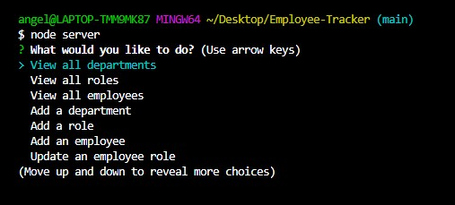
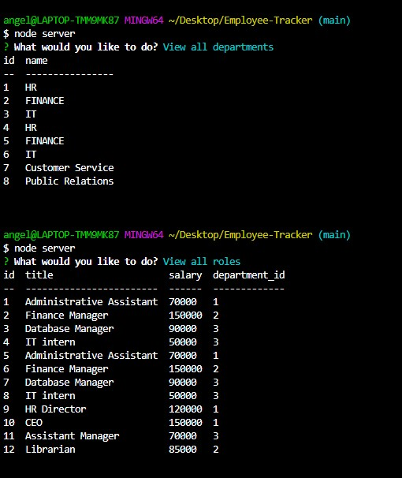
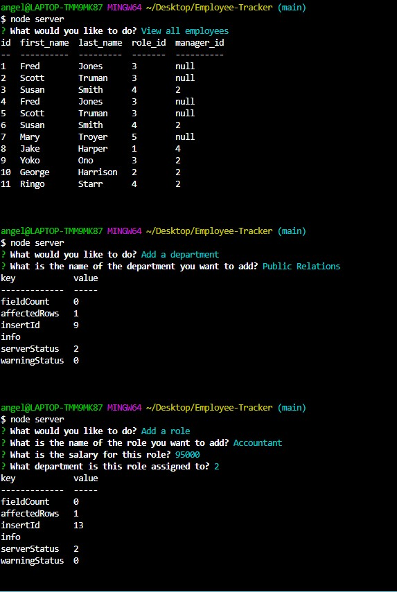

# Employee-Tracker

## Description

This is an application run through node.js that manages a database of employee information for a company.  It uses inquirer and SQL to receive and retreive information.

This current version is an MVP.  For some tasks I limited possible responses to some pre-selected values.  Ideally, the user would be presented with a more readable and current list of options to choose from that would then be converted into the values required by the database.  

## Built with

-  Javascript
-  Inquirer
-  MySQL2
-  console.table

## Demo

-  View a demo of this application here: https://drive.google.com/file/d/12r4O9XCsb0EAm9vNBpyBB_msnPrfOxYi/view?usp=sharing

-  Screenshots showing the menu of options and some of the results:

## Usage 

This application can only be run if the user downloads all the files included, as well as the required node modules, to their own computer and substitutes their own MySQL login credentials for the credentials provided.  They will also need to seed the database with information before beginning.  The application can then be launched through the command terminal using the words "node server".  

## Credits
-  Created by Angela Gustafson (angiebunk1)